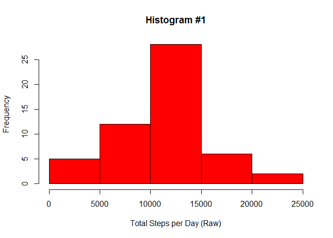
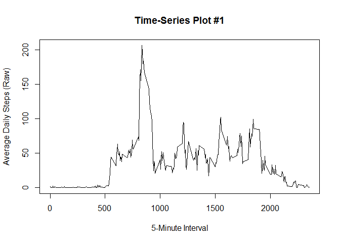
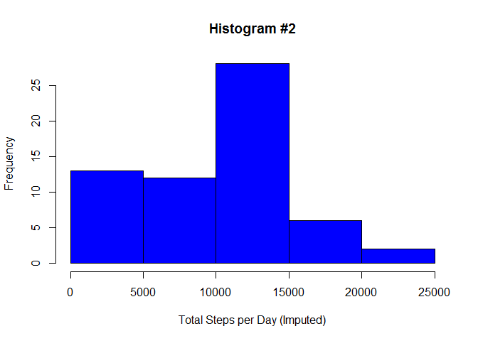
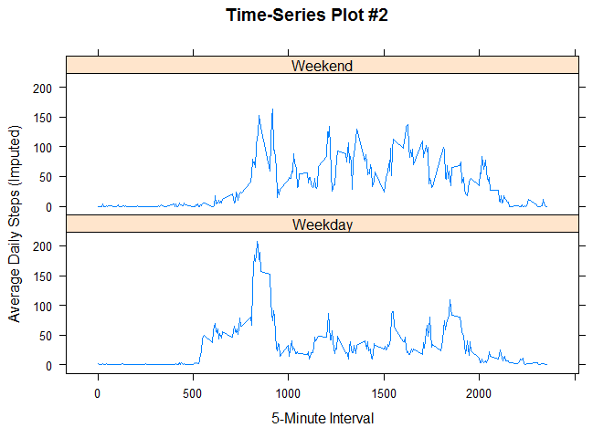

# Reproducible Research: Peer Assessment 1
Rebecca Ziebell  
`r format(Sys.Date(), format="%d %B %Y")`  

## Loading and preprocessing the data

**Clean up workspace before downloading source data, unzipping the file, and**
**loading into a data frame.**


```r
rm(list = ls())

temp <- tempfile()

url <- "http://d396qusza40orc.cloudfront.net/repdata%2Fdata%2Factivity.zip"

download.file(url, temp, mode="wb")

activity <- read.csv(unzip(temp, "activity.csv"), stringsAsFactors = FALSE)

unlink(temp)

str(activity)
```

```
## 'data.frame':	17568 obs. of  3 variables:
##  $ steps   : int  NA NA NA NA NA NA NA NA NA NA ...
##  $ date    : chr  "2012-10-01" "2012-10-01" "2012-10-01" "2012-10-01" ...
##  $ interval: int  0 5 10 15 20 25 30 35 40 45 ...
```

**Install dplyr and lattice packages for later use.**


```r
pkg_list <- c("dplyr", "lattice")

pkg_inst <- pkg_list %in% installed.packages()

if(length(pkg_list[!pkg_inst]) > 0) install.packages(pkg_list[!pkg_inst])

lapply(pkg_list, require, character.only = TRUE)
```

## What is the total number of steps taken per day?
**For this part of the assignment, ignore missing values in dataset.**


```r
non_missing <- activity[complete.cases(activity), ]

str(non_missing)
```

```
## 'data.frame':	15264 obs. of  3 variables:
##  $ steps   : int  0 0 0 0 0 0 0 0 0 0 ...
##  $ date    : chr  "2012-10-02" "2012-10-02" "2012-10-02" "2012-10-02" ...
##  $ interval: int  0 5 10 15 20 25 30 35 40 45 ...
```

**1\. Calculate the total number of steps taken per day.**


```r
tot_steps_raw <- non_missing %>%
  group_by(date) %>%
  summarize(tot_steps_raw = sum(steps))

head(tot_steps_raw)
```

```
## Source: local data frame [6 x 2]
## 
##         date tot_steps_raw
## 1 2012-10-02           126
## 2 2012-10-03         11352
## 3 2012-10-04         12116
## 4 2012-10-05         13294
## 5 2012-10-06         15420
## 6 2012-10-07         11015
```

**2\. Make a histogram of the total number of steps taken each day.**


```r
with(tot_steps_raw, hist(tot_steps_raw, col="Red", 
                         xlab="Total Steps per Day (Raw)",
                         main="Histogram #1"))
```

 

**3\. Calculate and report the mean and median of the total steps per day.**


```r
mean_tot_raw <- mean(tot_steps_raw$tot_steps_raw)

med_tot_raw <- median(tot_steps_raw$tot_steps_raw)
```

Mean total steps/day (ignoring missing values): 
10,766.19  
Median total steps/day (ignoring missing values):
10,765

## What is the average daily activity pattern?

**1\. Make a time series plot of the 5-minute interval (x-axis) and average**
**number of steps taken, averaged across all days (y-axis).**


```r
avg_steps_raw <- non_missing %>%
  group_by(interval) %>% 
  summarize(avg_steps_raw = mean(steps))

with(avg_steps_raw, plot(avg_steps_raw ~ interval, 
                         type="l", 
                         xlab="5-Minute Interval",
                         ylab="Average Daily Steps (Raw)", 
                         main="Time-Series Plot #1"))
```

 

**2\. Which 5-minute interval, on average across all days in the dataset,**
**contains the maximum number of steps?**


```r
# Find interval(s) where avg_steps = max(avg_steps).
max_int <- avg_steps_raw[avg_steps_raw$avg_steps_raw == 
                           max(avg_steps_raw$avg_steps_raw), ]
```

Interval with maximum number of steps: 835

## Imputing missing values

**1\. Calculate and report the total number of missing values in the dataset.**


```r
missing_values <- sum(is.na(activity))
```

Number of missing values: 2,304

**2\. Devise a strategy for filling in the missing values in the dataset.**

Strategy: Replace missing values with mean number of steps for that 5-minute
interval on that day of the week (from dataset with missing values removed).

**3\. Create a new dataset that is equal to the original dataset but with**
**missing data filled in.**


```r
# Display first 6 rows of original dataset.
head(activity[is.na(activity$steps),])
```

```
##   steps       date interval
## 1    NA 2012-10-01        0
## 2    NA 2012-10-01        5
## 3    NA 2012-10-01       10
## 4    NA 2012-10-01       15
## 5    NA 2012-10-01       20
## 6    NA 2012-10-01       25
```

```r
# Calculate mean number of non-missing steps per day-of-week and interval.
non_missing$dow <- as.factor(weekdays(as.Date(non_missing$date)))

mean_steps <- non_missing %>%
  group_by(dow, interval) %>%
  summarize(mean_steps = mean(steps))

# Add mean steps per day/interval to original activity data. Replace missing
# steps with mean steps for that day/interval.
activity$dow <- as.factor(weekdays(as.Date(activity$date)))

act_imp <- inner_join(activity, mean_steps) %>% 
  arrange(date, interval) %>%
  rename(steps_raw = steps) %>%
  mutate(steps_imp = ifelse(is.na(steps_raw), mean_steps, steps_raw))
   
# Display first 6 rows of imputed dataset.
head(select(act_imp, steps_imp, date, interval))
```

```
##   steps_imp       date interval
## 1  1.428571 2012-10-01        0
## 2  0.000000 2012-10-01        5
## 3  0.000000 2012-10-01       10
## 4  0.000000 2012-10-01       15
## 5  0.000000 2012-10-01       20
## 6  5.000000 2012-10-01       25
```

**4\. Make a histogram of the total number of steps taken each day.**


```r
tot_steps_imp <- act_imp %>%
  group_by(date) %>%
  summarize(tot_steps_imp = sum(steps_imp))

with(tot_steps_imp, hist(tot_steps_imp, col = "Blue", 
                         xlab = "Total Steps per Day (Imputed)",
                         main = "Histogram #2"))
```

 

**4 (cont.) Calculate the mean and median total number of steps taken per day.**


```r
mean_tot_imp <- mean(tot_steps_imp$tot_steps_imp)

med_tot_imp <- median(tot_steps_imp$tot_steps_imp)
```

Mean total steps/day (after imputation): 
10,821.21  
Median total steps/day (after imputation): 
11,015

**4 (cont.) Do these values differ from the estimates from the first part**
**of the assignment? What is the impact of imputing missing data on the**
**estimates of the total daily number of steps?**


```r
mean_diff <- mean_tot_imp - mean_tot_raw

med_diff <- med_tot_imp - med_tot_raw
```

Change in average daily steps: 
55.02  
Change in median daily steps: 250

## Are there differences in activity patterns between weekdays and weekends? 

**1\. Create a new factor variable with two levels, "weekday" and "weekend."**


```r
act_imp$week_part <- as.factor(ifelse(act_imp$dow %in% c("Saturday", "Sunday"),
                                      "Weekend", "Weekday"))

table(act_imp$dow, act_imp$week_part)
```

```
##            
##             Weekday Weekend
##   Friday       2592       0
##   Monday       2592       0
##   Saturday        0    2304
##   Sunday          0    2304
##   Thursday     2592       0
##   Tuesday      2592       0
##   Wednesday    2592       0
```

**2\. Make a panel plot containing a time series plot (i.e. type = "l") of the**
**5-minute interval (x-axis) and the average number of steps taken, averaged**
**across all weekday days or weekend days (y-axis).**


```r
avg_steps_imp <- act_imp %>%
  group_by(week_part, interval) %>% 
  summarize(avg_steps_imp = mean(steps_imp))

xyplot(avg_steps_imp ~ interval | week_part, data = avg_steps_imp, type = "l",
       xlab = "5-Minute Interval", ylab = "Average Daily Steps (Imputed)",
       scales = list(y = list(alternating = FALSE)),
       main = "Time-Series Plot #2", layout = c(1, 2))
```

 
