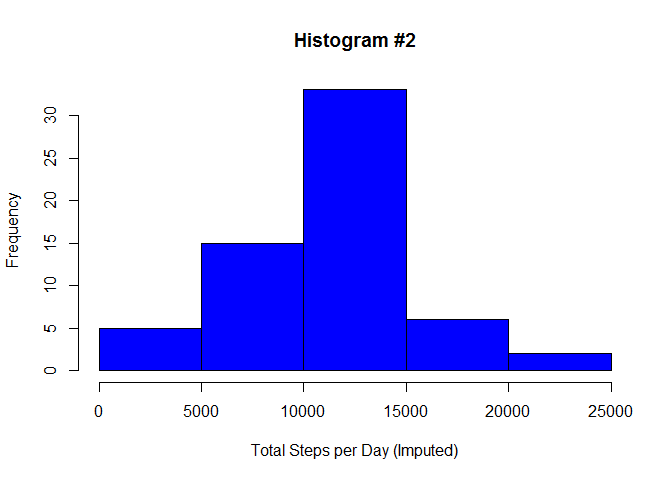

# Reproducible Research: Peer Assessment 1

Prepared by Rebecca Ziebell on August 15, 2015

## Loading and preprocessing the data

Clean up workspace before downloading source data, unzipping the file, and
loading into a data frame.


```r
rm(list = ls())

temp <- tempfile()

url <- "http://d396qusza40orc.cloudfront.net/repdata%2Fdata%2Factivity.zip"

download.file(url, temp, mode="wb")

activity <- read.csv(unzip(temp, "activity.csv"), stringsAsFactors = FALSE)

unlink(temp)

str(activity)
```

```
## 'data.frame':	17568 obs. of  3 variables:
##  $ steps   : int  NA NA NA NA NA NA NA NA NA NA ...
##  $ date    : chr  "2012-10-01" "2012-10-01" "2012-10-01" "2012-10-01" ...
##  $ interval: int  0 5 10 15 20 25 30 35 40 45 ...
```

Install dplyr and lattice packages for later use.


```r
pkg_list <- c("dplyr", "lattice")

pkg_inst <- pkg_list %in% installed.packages()

if(length(pkg_list[!pkg_inst]) > 0) install.packages(pkg_list[!pkg_inst])

lapply(pkg_list, require, character.only = TRUE)
```

```
## [[1]]
## [1] TRUE
## 
## [[2]]
## [1] TRUE
```

## What is the total number of steps taken per day?

1\. Calculate the total number of steps taken per day.


```r
tot_steps_raw <- activity %>% 
  group_by(date) %>% 
  summarize(tot_steps_raw = sum(steps, na.rm = TRUE))

head(tot_steps_raw)
```

```
## Source: local data frame [6 x 2]
## 
##         date tot_steps_raw
## 1 2012-10-01             0
## 2 2012-10-02           126
## 3 2012-10-03         11352
## 4 2012-10-04         12116
## 5 2012-10-05         13294
## 6 2012-10-06         15420
```

2\. Make a histogram of the total number of steps taken each day.


```r
with(tot_steps_raw, hist(tot_steps_raw, col="Red", 
                         xlab="Total Steps per Day (Raw)",
                         main="Histogram #1"))
```

 

3\. Calculate and report the mean and median of the total steps per day.


```r
mean_med_raw <- summarize(tot_steps_raw, 
                          mean_steps_raw = mean(tot_steps_raw, na.rm = TRUE),
                          med_steps_raw = median(tot_steps_raw, na.rm = TRUE))

mean_med_raw
```

```
## Source: local data frame [1 x 2]
## 
##   mean_steps_raw med_steps_raw
## 1        9354.23         10395
```

## What is the average daily activity pattern?

1\. Make a time series plot of the 5-minute interval (x-axis) and average number
of steps taken, averaged across all days (y-axis).


```r
avg_steps_raw <- activity %>%
  group_by(interval) %>% 
  summarize(avg_steps_raw = mean(steps, na.rm = TRUE))

with(avg_steps_raw, plot(avg_steps_raw ~ interval, 
                         type="l", 
                         xlab="5-Minute Interval",
                         ylab="Average Daily Steps (Raw)", 
                         main="Time-Series Plot #1"))
```

 

2\. Which 5-minute interval, on average across all days in the dataset, contains
the maximum number of steps?


```r
# Print row(s) where avg_steps = max(avg_steps).
avg_steps_raw[avg_steps_raw$avg_steps_raw == max(avg_steps_raw$avg_steps_raw,
                                                 na.rm = TRUE), ]
```

```
## Source: local data frame [1 x 2]
## 
##   interval avg_steps_raw
## 1      835      206.1698
```

## Imputing missing values

1\. Calculate and report the total number of missing values in the dataset.


```r
nrow(subset(activity, is.na(activity$steps)))
```

```
## [1] 2304
```

2\. Devise a strategy for filling in the missing values in the dataset.

*Strategy: Replace missing values with median number of steps for that 5-minute
interval on that day of the week.*

3\. Create a new dataset that is equal to the original dataset but with missing 
data filled in.


```r
# Display first 6 rows of original dataset:
head(activity[is.na(activity$steps),])
```

```
##   steps       date interval
## 1    NA 2012-10-01        0
## 2    NA 2012-10-01        5
## 3    NA 2012-10-01       10
## 4    NA 2012-10-01       15
## 5    NA 2012-10-01       20
## 6    NA 2012-10-01       25
```

```r
# Create day-of-week variable and calculate median number of steps per
# day-of-week and interval.
activity$dow <- as.factor(weekdays(as.Date(activity$date)))

med_steps <- activity %>%
  group_by(dow, interval) %>%
  summarize(med_steps = median(steps, na.rm = TRUE) * 1.0)

# Add median steps per day/interval to original activity data.
act_imp <- inner_join(activity, med_steps) %>% arrange(date, interval)

# Replace missing steps values with median steps for that day/interval.
act_imp$steps_imp <- ifelse(is.na(act_imp$steps), 
                            act_imp$med_steps,
                            act_imp$steps)

# Display first 6 rows of imputed dataset:
head(act_imp)
```

```
##   steps       date interval    dow med_steps steps_imp
## 1    NA 2012-10-01        0 Monday         0         0
## 2    NA 2012-10-01        5 Monday         0         0
## 3    NA 2012-10-01       10 Monday         0         0
## 4    NA 2012-10-01       15 Monday         0         0
## 5    NA 2012-10-01       20 Monday         0         0
## 6    NA 2012-10-01       25 Monday         0         0
```

4\. Make a histogram of the total number of steps taken each day. 


```r
tot_steps_imp <- act_imp %>%
  group_by(date) %>%
  summarize(tot_steps_imp = sum(steps_imp, na.rm = TRUE))

with(tot_steps_imp, hist(tot_steps_imp, col="Blue", 
                         xlab="Total Steps per Day (Imputed)",
                         main="Histogram #2"))
```

 

4, cont'd. Calculate the mean and median total number of steps taken per day. 


```r
mean_med_imp <- summarize(tot_steps_imp,
                          mean_steps_imp = mean(tot_steps_imp),
                          med_steps_imp = median(tot_steps_imp))

mean_med_imp
```

```
## Source: local data frame [1 x 2]
## 
##   mean_steps_imp med_steps_imp
## 1       9705.238         10395
```

4, cont'd. Do these values differ from the estimates from the first part of the
assignment? What is the impact of imputing missing data on the estimates of the
total daily number of steps?


```r
mean_med_diff <- mean_med_imp - mean_med_raw

names(mean_med_diff) <- c("mean_steps_diff", "med_steps_diff")

mean_med_diff
```

```
##   mean_steps_diff med_steps_diff
## 1        351.0082              0
```

*Impact: Average daily steps increases by 351; median daily steps is unchanged.*

## Are there differences in activity patterns between weekdays and weekends?

1\. Create a new factor variable with two levels, "weekday" and "weekend."


```r
act_imp$week_part <- as.factor(ifelse(act_imp$dow %in% c("Saturday", "Sunday"),
                                      "Weekend", "Weekday"))

table(act_imp$dow, act_imp$week_part)
```

```
##            
##             Weekday Weekend
##   Friday       2592       0
##   Monday       2592       0
##   Saturday        0    2304
##   Sunday          0    2304
##   Thursday     2592       0
##   Tuesday      2592       0
##   Wednesday    2592       0
```

2\. Make a panel plot containing a time series plot (i.e. type = "l") of the
5-minute interval (x-axis) and the average number of steps taken, averaged
across all weekday days or weekend days (y-axis).


```r
avg_steps_imp <- act_imp %>%
  group_by(week_part, interval) %>% 
  summarize(avg_steps_imp = mean(steps_imp, na.rm = TRUE))

xyplot(avg_steps_imp ~ interval | week_part, data = avg_steps_imp, type = "l",
       xlab = "5-Minute Interval", ylab = "Average Daily Steps (Imputed)",
       scales = list(y = list(alternating = FALSE)),
       main = "Time-Series Plot #2", layout = c(1, 2))
```

 
